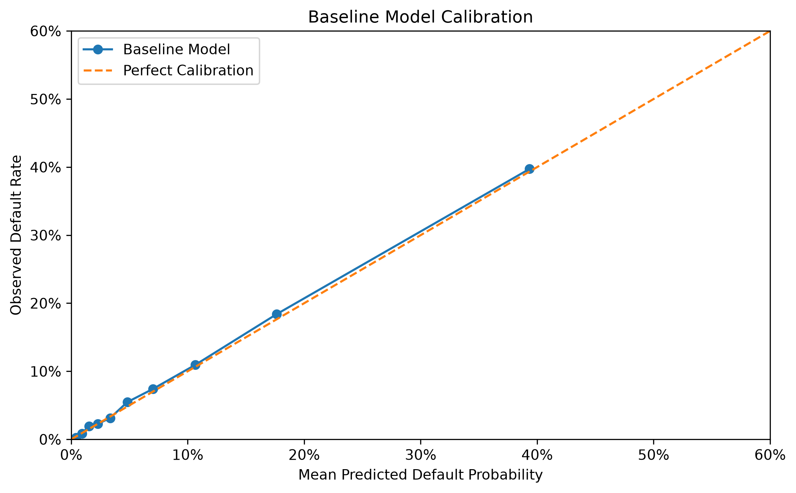

# Adaptive Model Risk

**Adaptive Model Risk** is an open-source research project focused on detecting and diagnosing deterioration in predictive models when the economic environment, population, or underlying relationships in the data change over time.

## Baseline Model Experiment

The first reproducible experiment is now available.

The baseline notebook creates a controlled synthetic credit-risk environment, generates borrower default outcomes from a known probability-of-default process, trains a logistic regression model, and establishes reference performance metrics for later model-deterioration experiments.

**Baseline test performance**

| Metric                    |  Value |
| ------------------------- | -----: |
| ROC AUC                   |  0.839 |
| Brier Score               | 0.0683 |
| Log Loss                  | 0.2368 |
| Calibration Error         | 0.0042 |
| MAE vs. Synthetic True PD | 0.0028 |

These results represent a deliberately healthy baseline model. Future experiments will keep the trained model fixed while changing the operating environment to study covariate drift, concept drift, calibration deterioration, and model-performance degradation.

[View the baseline notebook](notebooks/01_baseline_model.ipynb)

### Baseline Calibration

> **Note:** The current experiment uses synthetic data and an intentionally controlled data-generating process. It is designed to study model-risk mechanisms and should not be interpreted as a production credit-risk model or as representative of any financial institution.

## Motivation

Financial institutions increasingly rely on statistical and machine-learning models for credit risk, forecasting, fraud detection, customer analytics, and other decision-making processes.

These models are generally developed using historical relationships between predictors and outcomes. However, economic conditions, customer populations, market behavior, and relationships among variables can change.

As a result, a model that performed well when it was developed may remain operational while becoming progressively less reliable.

This project investigates methods for identifying these changes, measuring their effect on predictive models, diagnosing the causes of deterioration, and evaluating possible responses.

## Research Focus

The project will investigate several related forms of model instability, including:

- data distribution shift;
- prediction drift;
- model performance degradation;
- calibration deterioration;
- changes in relationships between predictors and outcomes;
- model sensitivity to changing economic regimes.

A central objective is to distinguish between **changes in data that are statistically observable** and **changes that materially affect model reliability**.

## Initial Research Questions

The project currently focuses on questions including:

1. How early can changes in data distributions indicate deterioration in financial predictive models?
2. Which types of distribution shift are most strongly associated with deterioration in predictive performance or calibration?
3. Can model-aware drift measures distinguish consequential model changes from benign population changes?
4. Can controlled stress scenarios identify conditions under which a previously validated model becomes unreliable?
5. How can multiple monitoring signals inform decisions to continue monitoring, investigate, recalibrate, retrain, or redevelop a model?

## Planned Project Components

The project is expected to include:

- public financial datasets;
- baseline predictive models;
- temporal model validation;
- drift-detection methods;
- model-performance monitoring;
- calibration monitoring;
- economic-regime comparisons;
- controlled stress experiments;
- diagnostic methods;
- reproducible Python implementations and notebooks.

## Current Status

The project has progressed from initial research design to experimental implementation.

The first baseline experiment is complete and includes:

* a reproducible synthetic credit-risk data-generating process;
* a baseline logistic regression model;
* held-out model evaluation;
* discrimination and calibration analysis;
* comparison of model-predicted risk with known synthetic true risk;
* reproducible figures and baseline monitoring metrics.

Current development is focused on creating controlled future environments in which the baseline model is exposed to distribution shift and changes in the relationship between predictors and outcomes.

The next experiments will investigate the distinction between changes in $P(X)$, changes in $P(Y \mid X)$, and actual deterioration in model reliability.

## Documentation

Project documentation will be maintained in the [`docs`](docs/) directory.

## Data

Only public, appropriately licensed, or independently generated data will be used.

See [`data/README.md`](data/README.md) for data-management principles.

## Disclaimer

This is an independent research project and does not represent the views or practices of any current or former employer or other organization.

See [`DISCLAIMER.md`](DISCLAIMER.md) for the full disclaimer.

## License

This project is licensed under the Apache License 2.0.
